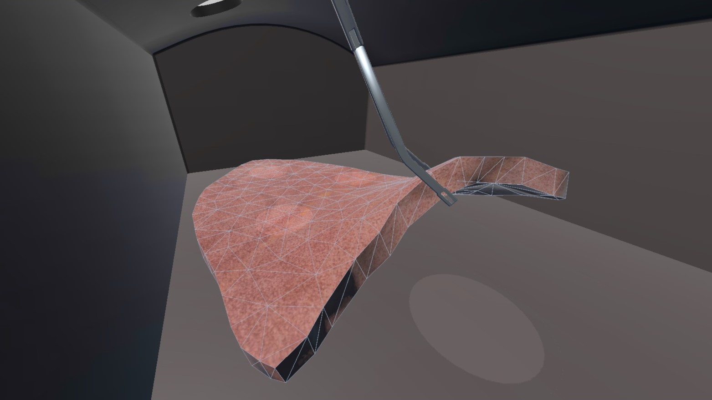

# Thoracoscopic Training VR

## Overview
This project presents an innovative Virtual Reality (VR) simulation platform designed for thoracoscopic surgery training. Utilizing advanced soft-body simulation techniques, particularly Extended Position-Based Dynamics (XPBD), this platform offers a cost-effective and accessible solution for training thoracic surgery residents in Video-Assisted Thoracoscopic Surgery (VATS) techniques.

## Key Features
- **Realistic Soft-Body Simulation**: Implements XPBD to accurately model the behavior of lung tissue during surgical procedures.
- **VR Integration**: Developed for Meta Quest 2, providing an immersive training experience.
- **Real-Time Interaction**: Offers immediate visual and haptic feedback for realistic surgical tool-tissue interactions.
- **Customizable Training Scenarios**: Includes various exercises designed to progressively enhance soft-body manipulation skills.
- **Performance Evaluation**: Incorporates a comprehensive system for assessing and providing feedback on trainee performance.

## Technical Details
- **Simulation Framework**: Uses a particle-based system with constraints to model deformable objects.
- **Mesh Generation**: Employs tetrahedral meshes refined using Delaunay techniques for volume preservation.
- **Unity Integration**: Seamlessly integrates the simulation into the Unity environment for real-time execution.
- **Data Collection**: Records simulation data in CSV format for detailed analysis and validation.

##  Experimental Results
The platform was evaluated in collaboration with thoracic surgery residents at the University of Turin. The study demonstrated:
- Improved performance across tasks of varying complexity.
- Positive feedback on the system's usability, realism, and educational value.
- Potential for enhancing surgical skills in a risk-free environment.

##  Future Directions
- Refinement of the computational model to include more complex tissue behaviors (e.g., tearing, cutting).
- Expansion of training scenarios to cover a wider range of surgical techniques.
- Extension to other types of surgeries, such as abdominal procedures.
- Longitudinal studies to compare VR training effectiveness with traditional methods.

## Contributors
- Marco Domenico Buttiglione - Politecnico di Milano
- Francesco Guerrera - Università di Torino
- Pietro Piazzolla - Politecnico di Milano
- Giorgio Colombo - Politecnico di Milano
- Marco Gribaudo - Politecnico di Milano

## Acknowledgments
This project was developed in collaboration between Politecnico di Milano and the University of Turin. We thank all the thoracic surgery residents who participated in our study and provided valuable feedback.

For more detailed information, please refer to our paper and the [demo video](https://www.youtube.com/watch?v=PSc5dPDgTFM).

Buttiglione, M.D., Guerrera, F., Piazzolla, P., Colombo, G., and Gribaudo, M. (2024). Lung Operation Training in Low-Cost Virtual Reality Simulation Environments. In Proceedings of the European Council for Modelling and Simulation (ECMS 2024). DOI: [10.7148/2024-0536](https://doi.org/10.7148/2024-0536)

